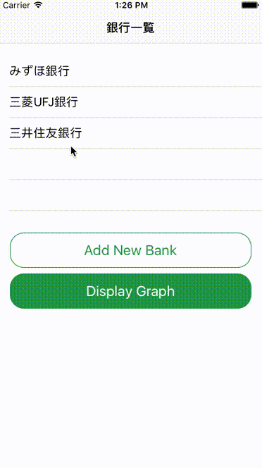
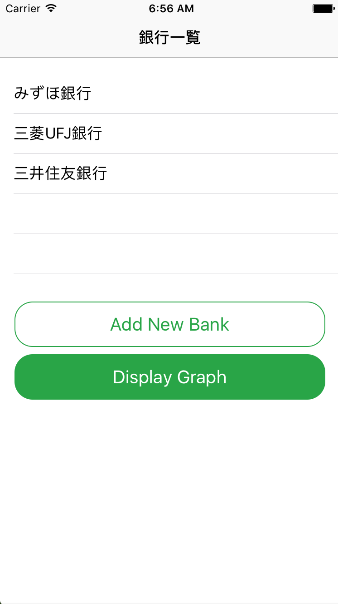
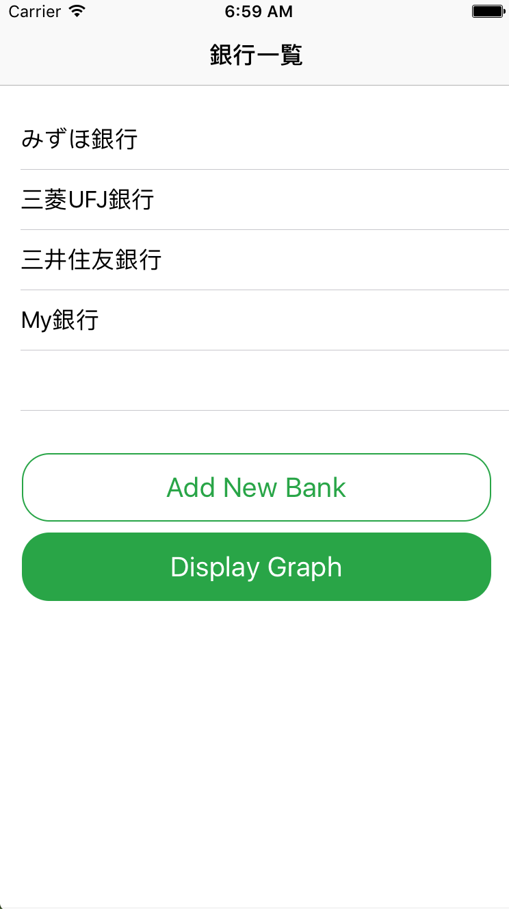
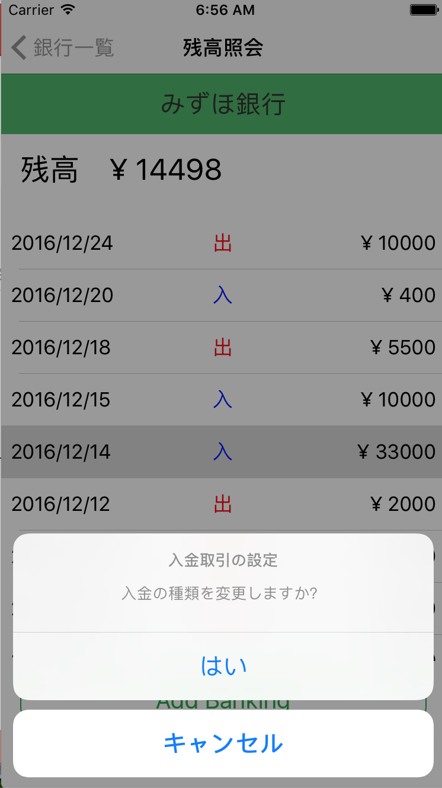
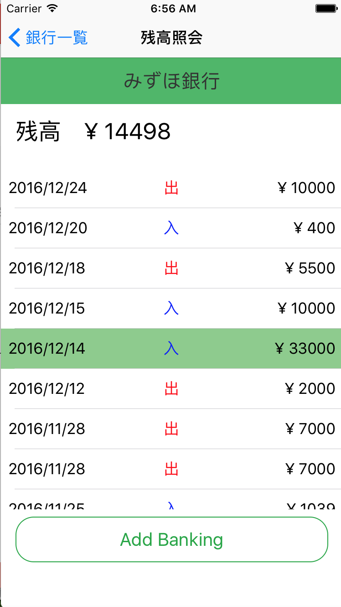
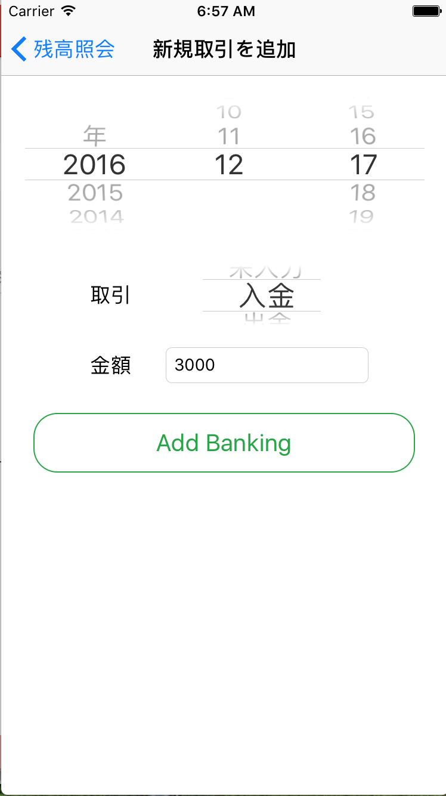
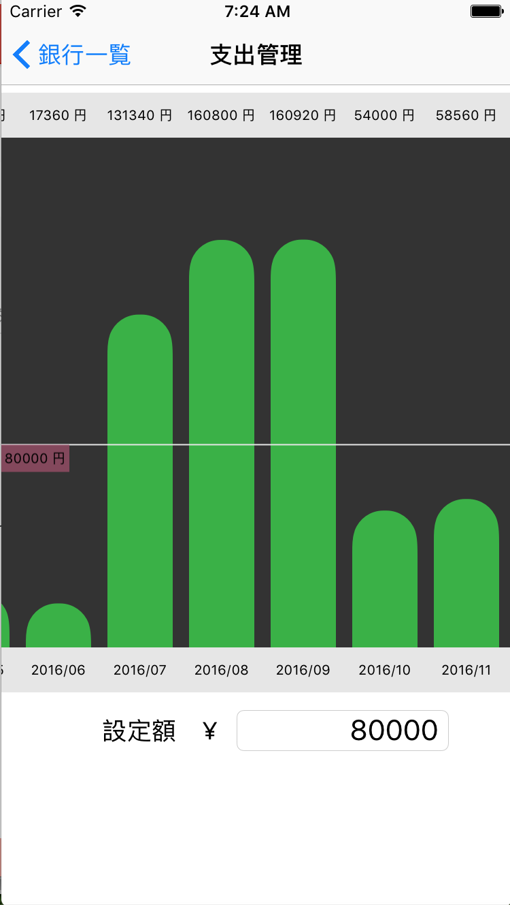

# MyBalanceInquiry

複数の銀行の残高照会や月々の支出を確認できるアプリのデモ。

## 機能

各ViewController(画面)での役割について

### ViewController

・自分が保持している銀行の一覧を表示

・銀行を選択すると残高照会ページに遷移

・銀行追加ページへの遷移

・支出閲覧ページへの遷移

### AddNewBankViewController

・銀行名と初期残高を入力して管理する銀行を追加

  

### MyBankViewController

・指定された銀行の残高と取引明細を表示

・取引明細は新しい順に上から表示され、過去全てを閲覧可能

・取引追加ページへの遷移

  

### BankingViewController

・取引の日付、種類（入金 or 出金）、金額を入力して取引データを追加

・追加後、前のページに戻る

・入力データが適切でないと、エラーメッセージを出し再入力を求める

### GraphViewController

・全ての銀行の取引データより、月々の支出を割り出しグラフで表示

・表示される期間は、最も古い取引が行われた年月から最も新しい取引が行われた年月まで

・任意に基準額を設定でき、グラフに表示し比較できる

## 特徴

こういったマネー管理ツールは多数存在するが、複数のマネーホルダー（勝手に名付けた：銀行など）を持つ場合の全体の支出額を正確に算出できていないことがある。

その理由として、”入金”を分類できていないことが挙げられる。

例）A銀行から5万円引き出して、B銀行に3万円預けた。

このような内部でのマネーの動きがあった場合、この”入金”を収入と捉えるか内部でただ移動が起こっただけと捉えるかでは大きな違いとなる。

他にも、

例）友達と旅行に行くため、自分が先にまとめて頭金を支払い、友達には後日口座に入金してもらった。

例）アマゾンで買った商品が不良品だったので返品したため全額戻ってきた。

など、入金が収入ではない場合は多数ある。

これらが複数のマネーホルダー間で複雑化すると全体の支出を算出することが困難になると考えられる。

### 入金の分類

各マネーホルダーで起こった”入金”を外部からの入金（給料など）と内部からの入金（上記のような例）に分類することで、正確な支出額を算出できることがわかった。

本アプリでは、`MyBankViewController`の取引明細の入金データを選択すると外部からの入金に設定を変更できる。

外部からの入金に設定したデータはセルの色が変更される。
